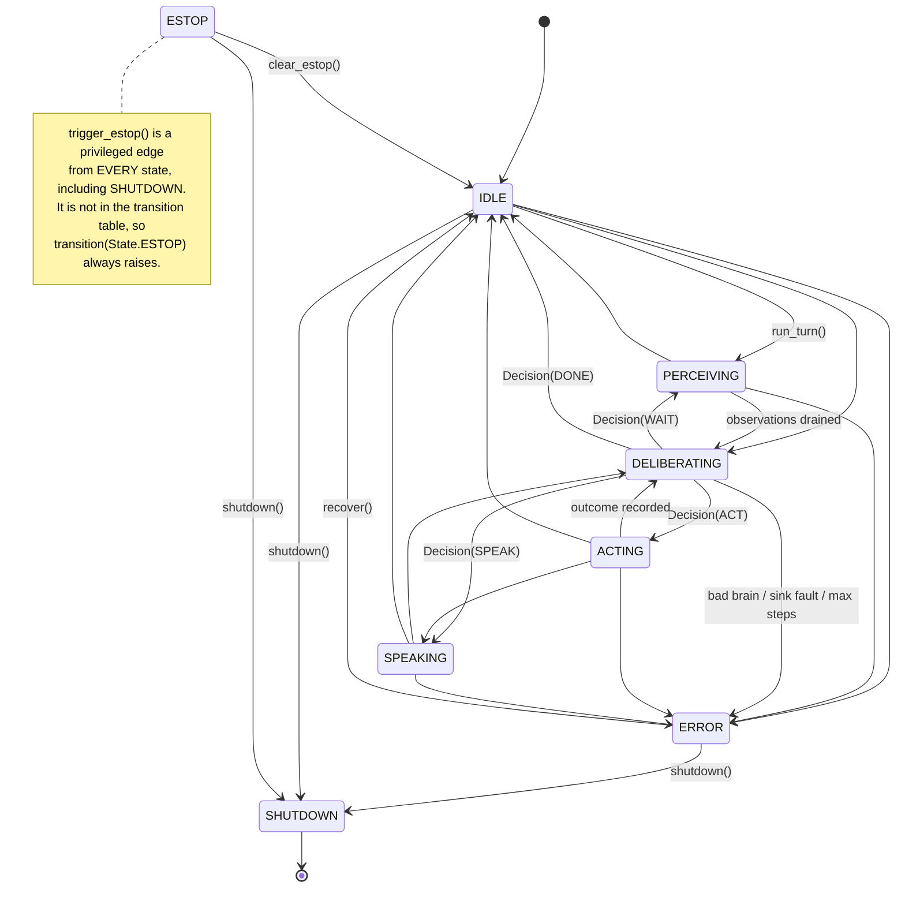

# Stage H / I1–I2 — harness skeleton and tool safety boundary

Design notes for the two first Stage H integration slices. **This file should be
folded into [`08-agent.md`](08-agent.md) once I3–I8 land**; it exists separately
so I1/I2 can be reviewed without touching the Stage doc other agents are editing.

Scope: pure software. No models are loaded, no camera or ALSA device is opened,
no I2C transaction happens, and `config/robot.yaml` stays `backend: mock`.

| Ticket | Issue | Code | Tests |
| --- | --- | --- | --- |
| I1 Hermes harness skeleton | [#20](https://github.com/AbuAyah110/jetbot-orin-super/issues/20) | `jetbot_agent/agent/hermes_harness.py` | `tests/unit/test_hermes_harness.py` |
| I2 Tool interface + safety | [#21](https://github.com/AbuAyah110/jetbot-orin-super/issues/21) | `jetbot_agent/agent/tools/{base,motion,registry,mocks}.py` | `tests/unit/test_tool_safety.py` |

## I1 — state machine

`HermesHarness` sequences one turn. It has no tool execution, no LLM call, and
no hardware access; perception, decision making, actions, and speech are all
injected.



### Transition rules

* `LEGAL_TRANSITIONS` is the whole table; `transition()` raises
  `IllegalTransition` for anything else, and `is_legal(src, dst)` exposes it for
  tests and callers.
* `ERROR` is reachable from `IDLE`, `PERCEIVING`, `DELIBERATING`, `ACTING`, and
  `SPEAKING`. It is not reachable from `ESTOP` (an e-stop outranks a fault),
  from `SHUTDOWN` (terminal), or from itself.
* `SHUTDOWN` is terminal: it has no outgoing edges, `run_turn()` and `submit()`
  raise afterwards, and `shutdown()` is idempotent.
* `ESTOP` appears in **no** table entry. The only entry is `trigger_estop()` and
  the only exit is `clear_estop()`, which matches `estop.latch: true` in
  `config/robot.yaml` (`HarnessConfig.from_robot_config` reads that key).
  With `estop_latch=False` the next `run_turn()` auto-clears and logs
  `estop_auto_cleared`; the repo config latches.
* Leaving `ERROR` needs an explicit `recover()`, and `recover()` refuses while an
  e-stop is latched.

### Turn loop

`run_turn(prompt, observations)` must start from `IDLE`, then:

1. `PERCEIVING` — drain the observation queue (thread-safe `submit()`).
2. `DELIBERATING` — ask the brain for a `Decision`.
3. Dispatch `ACT` → `ACTING` (hand the `Action` to the `ActionSink`), `SPEAK` →
   `SPEAKING`, `WAIT` → back to `PERCEIVING`, `DONE` → `IDLE`.
4. Repeat until `DONE`, e-stop, fault, or the max-steps guard.

`TurnResult.stop_reason` is one of `done`, `max_steps`, `estop`, `error`. Every
step is counted, including `WAIT`, so a brain that never finishes ends in `ERROR`
with `max_steps` rather than spinning forever. A brain that returns a non-
`Decision`, or a sink that raises or returns the wrong type, lands in `ERROR`
instead of propagating a crash into the robot process.

### E-stop responsiveness

The core loop never sleeps. Any queue wait is clamped to `MAX_BLOCK_SEC`
(0.05 s), the e-stop flag is a `threading.Event` checked at the top of every step
and again after each decision, and `trigger_estop()` is safe to call from another
thread, a signal handler, or a `__exit__`. E-stop hooks (`add_estop_hook`) run
fail-safe: a hook that raises is logged as `estop_hook_failed` and never blocks
the stop.

### Pluggable brain

```python
class Brain(Protocol):
    def decide(self, context: TurnContext) -> Decision: ...
```

`TurnContext` carries the prompt, drained observations, prior decisions and
outcomes, step/max-steps, and `estop_active`. `FakeBrain` replays a scripted
list of decisions (optionally looping, which is how the max-steps guard is
tested). A real Qwen/Cosmos client implements the same two-line protocol later —
nothing else in the harness changes.

Structured logging: every transition, decision, dispatch, e-stop, and turn
boundary is emitted through `logging` **and** appended to a bounded in-memory
`events` ring buffer of `HarnessEvent(event, ts, fields)`, so tests assert on
behaviour rather than on log text.

I1 executes nothing: the default `NullActionSink` records the `Action` and
returns `ActionOutcome(executed=False)`. `hermes_harness.py` imports no tool
module, no `jetbot_control`, and no `jetbot_agent.hardware` — a subprocess test
asserts `sys.modules` stays clean after a full scripted turn, which is the
issue #20 gate.

## I2 — the safety boundary

### The invariant

From [`docs/architecture.md`](../architecture.md): **LLMs never set PWM, never
write GPIO, never disable the watchdog.**

```text
brain (LLM/VLM)
   │  Decision(ACT, name + validated args)
   ▼
ToolRegistry            deny-by-default allow-list + capability grants + per-call watchdog
   │
   ▼
Tool._run(ctx)          sees ONLY narrow interfaces on ToolContext
   │  drive / rotate / stop / status / limits
   ▼
MotionInterface adapter (outside the tool package, wired in I5/I8)
   │  /cmd_vel
   ▼
jetbot_base             velocity clamps + cmd_vel watchdog + e-stop
   │
   ▼
MotorDriver → wheels
```

### How it is enforced, not just documented

1. **The tool layer is never handed a low-level object.** `ToolContext` is the
   only capability carrier, and its `__post_init__` runs
   `assert_narrow_motion()`, which raises `ToolSafetyViolation` when the object
   exposes any attribute in `FORBIDDEN_MOTION_ATTRS` (`set_velocity`, `set_pwm`,
   `duty_cycle`, `write_byte`, `write_i2c_block_data`, `clear_estop`,
   `disable_watchdog`, `_driver`, `_bus`, …), when its MRO contains
   `MotorDriver` / `DiffDriveController` / `MotorController`, when it comes from
   `jetbot_control.motors`, `jetbot_agent.hardware`, `smbus`, or `Jetson.*`, or
   when it fails to implement the full `MotionInterface`. Passing a
   `MockMotorDriver` **or even the correct `DiffDriveController`** fails at
   construction — the tool layer gets an adapter, never the controller itself.
2. **The dangerous vocabulary does not exist at the tool surface.**
   `MotionInterface` is `drive` / `rotate` / `stop` / `status` / `limits`. There
   is no wheel-speed, PWM, register, or watchdog setter anywhere in the contract,
   and `MotionLimits` is a frozen dataclass, so limits are readable and not
   writable.
3. **The tool package cannot import its way down.** No module under
   `jetbot_agent/agent/tools/` imports `jetbot_control`, `jetbot_base`,
   `jetbot_agent.hardware`, `smbus`, `busio`, `board`, `Jetson.*`, or `RPi.*`.
   A parametrized test walks the AST of every file in the package and fails on
   such an import, on any executable reference to identifiers like
   `set_velocity`, `PCA9685`, `SMBus`, or `GPIO`, and on device-path literals
   (`/dev/i2c`, `/sys/class/pwm`, …). A second test imports the package in a
   subprocess and asserts none of those modules appear in `sys.modules`. The
   guard was verified by temporarily adding a violating module and watching both
   tests fail.
4. **A model cannot name a low-level parameter.** `RESERVED_PARAM_NAMES`
   (`pwm`, `duty_cycle`, `left_pwm`, `i2c_bus`, `gpio`, `pin`, `register`,
   `timeout`, `timeout_sec`, `watchdog`, `estop`, `set_velocity`, …) is rejected
   at class-definition time, so a schema physically cannot advertise those keys.
5. **Schemas are closed.** `additionalProperties: False` is mandatory and
   arguments are validated before the body runs, so extra keys are refused
   rather than ignored.

### Tool risk model

| Risk class | Capability | Grant | Examples |
| --- | --- | --- | --- |
| `READ_ONLY` | `Capability.READ` | plain `grant()` / constructor | `mock_echo`, later OCR/grounding reads (I3) |
| `NETWORK` | `Capability.NETWORK` | plain `grant()`; results are **data, never policy** | `mock_search`, later Tavily (I4) |
| `ACTUATION` | `Capability.ACTUATE` | `grant(Capability.ACTUATE, operator_ack=True)` only | `mock_drive`, `mock_stop`, later navigate/rotate (I5) |

Two independent gates must both open for any call:

* **Allow-list.** `register(tool)` only catalogues; the tool stays un-invocable
  until `allow(name)`. An unregistered name raises `ToolPermissionError`, so a
  hallucinated `set_pwm` call is a refusal, not a traceback.
* **Capability grant.** The risk class maps to a capability the operator must
  have granted. `ACTUATE` additionally requires `operator_ack=True` (or
  `operator_ack_actuation=True` at construction): an agent holding a registry
  cannot opt itself into moving the robot. `describe()` only advertises invocable
  tools, so the model is not even told about ungranted capabilities.

### Per-call watchdog

Every call runs in a worker thread with `future.result(timeout=...)` where the
window is `effective_timeout(tool)`, clamped to
`[MIN_TOOL_TIMEOUT_SEC, MAX_TOOL_TIMEOUT_SEC]` = `[0.01 s, 5.0 s]`. Neither
`invoke()` nor `dispatch()` accepts a caller-supplied timeout — their signatures
are `(name, arguments)` and a test asserts that — so raising `tool.timeout_sec`
(a compromised tool, or a model editing its own config) cannot widen the window.

On timeout: the future is cancelled, the timeout is counted, and for an
`ACTUATION` tool the registry immediately calls `motion.stop()`.
`ToolRegistry.close()` also stops motion. A Python thread cannot be killed, so
the tool-level timeout is a first line of defence only — the authoritative stop
remains the deterministic `cmd_vel` watchdog and velocity clamps in
`jetbot_base`, plus the physical e-stop.

## How to add a new tool safely

1. Subclass `Tool` (or `ActuationTool` for motion) in a module under
   `jetbot_agent/agent/tools/`. Declare `name` (lower_snake_case),
   `description`, `parameters`, `risk`, and a modest `timeout_sec`.
2. Write a closed JSON-schema-ish `parameters` block: `type: object`,
   `additionalProperties: False`, explicit `required`, and per-field bounds
   (`minimum`/`maximum`/`enum`/`maxLength`). Bound anything physical — a motion
   tool caps `linear`, `angular`, and `duration_sec` at the schema level in
   addition to the clamps below the boundary.
3. Keep `_run()` to the interfaces on `ToolContext`. If you find yourself
   wanting a motor driver, a bus handle, or a watchdog setter, the answer is a
   new **high-level** verb on the motion adapter below the boundary, not a wider
   context.
4. Never import `jetbot_control`, `jetbot_base`, `jetbot_agent.hardware`,
   `smbus`, or a GPIO library from this package. The AST test will fail, and that
   failure is the design working.
5. Register it deny-by-default: `registry.register(tool)` plus an explicit
   `allow(name)` in wiring code, and for actuation an operator-acknowledged
   `ACTUATE` grant. Nothing should be `allow=True` by default in production
   wiring.
6. Add tests next to the existing ones: a happy path, at least one validation
   rejection, and — for actuation — a proof that a timeout stops the base.

## Verify

```bash
.venv/bin/python -m pytest tests/unit -q                       # whole suite
.venv/bin/python -m pytest tests/unit/test_hermes_harness.py -q # I1 gate
.venv/bin/python -m pytest tests/unit/test_tool_safety.py -q    # I2 gate
```

Tests add the repo root, `src`, and `ros2_ws/src/jetbot_base` to `sys.path`
themselves (matching `tests/unit/test_motor_and_controller.py`), so the
`pyproject.toml` pytest config needs no change. `pytest` is a dev dependency
(`pip install -e '.[dev]'`).

## Deliberately deferred

* The concrete `MotionInterface` adapter over `/cmd_vel` /
  `DiffDriveController` — Stage H / I5, and it must live **outside** the tools
  package.
* The `ActionSink` implementation that routes harness actions into
  `ToolRegistry.dispatch()` — Stage H / I8, so I1 keeps its no-tool-imports gate.
* Real brain client, vision/search/voice/engine tools — I3, I4, I6, I7.
* Async/`asyncio` harness, multi-turn episode memory, and Chroma/SQLite memory
  tools — Stage I and later.
